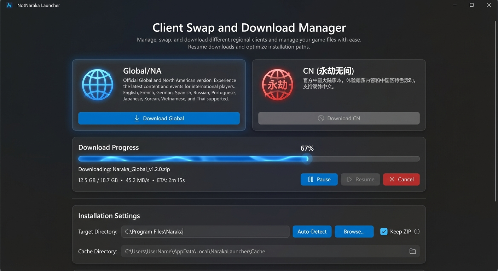

# 🎯 NotNaraka Launcher

**The Ultimate Companion for Naraka: Bladepoint**

**Client Swapping | Performance Tweaks | Twitch Drops | Custom Overlay**

---

## 🚀 Why NotNaraka?

NotNaraka Launcher is designed to enhance your Naraka: Bladepoint experience without compromising fair play. Whether you play on Steam, Epic, or Xbox, this launcher unifies your experience with powerful tools to optimize performance and automate rewards.

## ✨ Key Features

### 🌟 Dashboard
The central hub for all your Naraka activities—stream discovery, quick launch, and real-time status monitoring.

### 🔄 Universal Client Swapping
Seamlessly switch between different game clients (Steam, Epic Games, Xbox/Microsoft Store) with a single click. No need to reinstall the game multiple times—NotNaraka manages the files for you.

### 🛠️ Performance Tweaks
Unlock the full potential of your hardware with built-in optimizations:
- **Nvidia Profile Inspector Integration**: Apply optimized driver settings instantly.
- **Registry Tweaks**: Safe system adjustments to reduce input lag and improve FPS.
- **Network Optimization**: Settings to help stabilize ping and packet loss.

### 📺 Automated Twitch Drops Farmer
Never miss a reward again!
- **Smart Auto-Watch**: Automatically finds and watches streams with active drops.
- **Drop Priority**: Intelligently selects channels that *actually* have drops enabled.
- **Background Mode**: Runs efficiently in the background while you do other things.

### 📊 Custom Performance Overlay (RTSS)
Monitor your game's performance with our built-in, anti-cheat safe overlay:
- **Real-Time Metrics**: FPS, Ping, CPU Usage, GPU Usage, and Game Time.
- **Fully Customizable**: Design your own overlay layout to match your style.
- **Powered by RTSS**: Uses RivaTuner Statistics Server for minimal impact and maximum compatibility.

### 🎮 Discord Rich Presence
Show off your status to friends with a fully animated Discord RPC:
- Displays whether you're In-Game, Idling, or Farming Drops.
- Custom "gamer" status animations.
- Quick links to join or spectate.

---

## 📥 Download & Install

**[⬇️ Download Latest Release](https://github.com/NotRatz/NotNaraka-Launcher/releases/latest)**

1. Download `NotNaraka-Launcher-Setup.exe`.
2. Run the installer as Administrator.
3. Follow the setup wizard.
4. (Optional) Install [RTSS](https://www.guru3d.com/download/rtss-rivatuner-statistics-server-download/) for the overlay feature.

---

## 📚 Documentation

- **[Quick Start Guide](QUICKSTART.md)** - Get running in 5 minutes
- **[Releases](https://github.com/NotRatz/NotNaraka-Launcher/releases)** - Download installer

---

## 🔐 Security & Privacy

### What We Collect
✅ Platform info (Steam/XboxGames/Epic/NetEase) for client detection.

### What We DON'T Collect
❌ Passwords or tokens
❌ Personal messages
❌ Payment information
❌ Game data

*Source code is kept private to protect API keys and prevent abuse, but the installer and documentation are open.*

---

## 🛠️ System Requirements

- **OS:** Windows 10 (1809+) or Windows 11
- **CPU:** Any x64 processor
- **RAM:** 2GB minimum (4GB recommended)
- **Disk:** 100MB free space
- **.NET:** 8.0 Runtime (included in installer)
- **Permissions:** Administrator (for process monitoring and tweaks)

---

## 📄 License

**MIT License** - See [LICENSE.txt](LICENSE.txt)

Copyright (c) 2025 NotRatz

---

**Built with ❤️ for the Naraka Bladepoint community**

*Disclaimer: NotNaraka Launcher is a third-party tool and is not affiliated with 24 Entertainment or NetEase Games. Use tweaks and optimizations at your own risk.*
